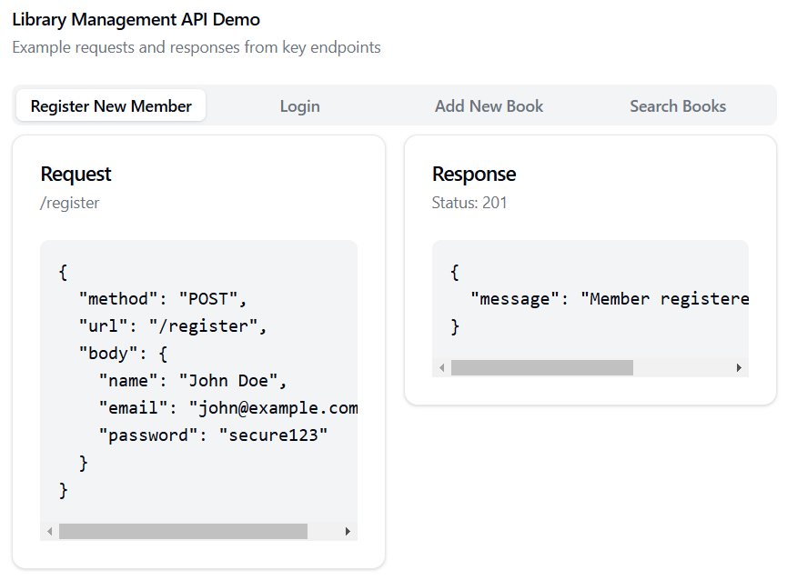
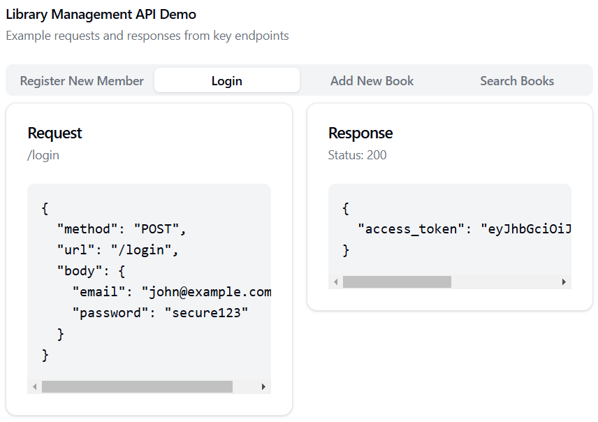
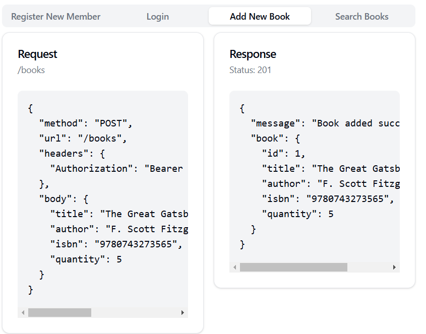
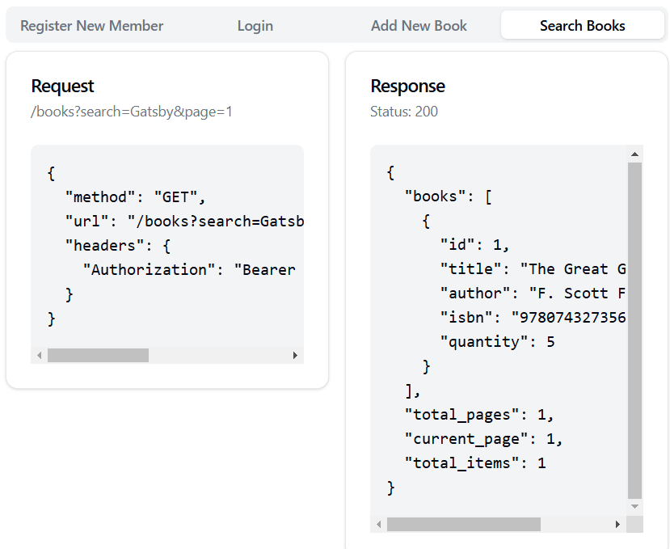

# Library Management System API

A Flask-based RESTful API for managing library resources, including books and members. The system provides CRUD operations with authentication, search functionality, and pagination.

## Features

- JWT-based Authentication
- Book Management (CRUD operations)
- Member Management (CRUD operations)
- Search functionality for books (by title or author)
- Pagination support for large datasets
- SQLite database for easy setup and testing

## Prerequisites

- Python 3.8 or higher
- pip (Python package manager)

## Installation

1. Clone the repository
```bash
git clone https://github.com/your-username/library-management-api.git
cd library-management-api
```

2. Create a virtual environment (optional & recommended)
```bash
python -m venv venv
source venv/bin/activate  # On Windows use: venv\Scripts\activate
```

3. Install dependencies
```bash
pip install -r requirements.txt
```

## Configuration

1. Update the configuration in `app.py`:
```python
app.config['JWT_SECRET_KEY'] = 'your-secret-key'  # Change this!
app.config['SQLALCHEMY_DATABASE_URI'] = 'sqlite:///library.db'
app.config['ITEMS_PER_PAGE'] = 10  # Adjust pagination as needed
```

## Running the Application

1. Initialize the database
```bash
python
>>> from app import app, db
>>> with app.app_context():
...     db.create_all()
>>> exit()
```

2. Start the server
```bash
python app.py
```

The API will be available at `http://localhost:5000`

## API Endpoints

### Authentication
- POST `/register` - Register a new member
- POST `/login` - Login and receive JWT token

### Books
- GET `/books` - List all books (with pagination and search)
- GET `/books/<id>` - Get a specific book
- POST `/books` - Create a new book
- PUT `/books/<id>` - Update a book
- DELETE `/books/<id>` - Delete a book

### Members
- GET `/members` - List all members (with pagination)
- GET `/members/<id>` - Get a specific member
- PUT `/members/<id>` - Update a member
- DELETE `/members/<id>` - Delete a member

## Design Choices

1. **Authentication**
   - JWT (JSON Web Tokens) for stateless authentication
   - Tokens expire after 24 hours for security
   - Password hashing using Werkzeug's security functions

2. **Database Design**
   - SQLite for simplicity and portability
   - SQLAlchemy ORM for database operations
   - Separate models for Books and Members

3. **API Design**
   - RESTful architecture following standard conventions
   - JSON response format
   - Pagination to handle large datasets efficiently
   - Search functionality implemented using SQL LIKE queries

4. **Code Structure**
   - Single file structure for simplicity
   - Clear separation of routes by resource type
   - Protected routes using JWT decorators

### Screenshots

## Screenshots

### 1. Member Registration

*Registration endpoint with successful response*

### 2. Authentication

*Login endpoint returning JWT token*

### 3. Adding Books

*Protected endpoint for adding new books to the library*

### 4. Search Functionality

*Searching books with pagination*
